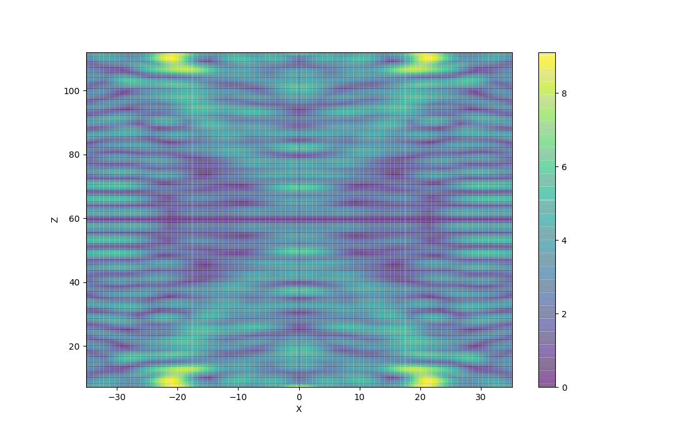

# Senior-Lab-Acoustic-Levitator

The following code can be used to calculate the pressure resulting from an array of transducers which are arranged as two spherical caps, where each transducer is pointing towards the center point between the transducer arrays. 
To run the code, download the files in the TinyLev folder, then open main.py. Adjust t_meshN and m_meshN to raise/lower the number of
meshpoints in the transducers and the measurement space. If you want the code to run quickly, I recommend t_meshN = 10 ; m_meshN = 50.
To achive more accurate results, a higher m_meshN (ie. 250) is required, but this will take several hours to load. The program could be
speed up by calculating the pressure matrices in parrallel using CUDA.

## Acoustic Levitation Papers

The code was created using the matrix method for determining the acoustic radiation force, which can be found [here](https://www.researchgate.net/publication/224254694_Matrix_Method_for_Acoustic_Levitation_Simulation)

I have also written two papers during the development of this code that describe the difficulties in adapting the Matrix Method to an arbitrary configuration. If you would like access to these papers, please contact me at rcato60@gmail.com. If you are on an admissions board and reading this, I have attatched the papers to my application. 

## Functionality

Currently the code only supports a spherical cap composed of three rings of transducers at three different heights. It also only supports an even number of transducers in each ring. This is due to complications in the matrix method from the transducers being positioned so that they emmit sound at an angle. 

